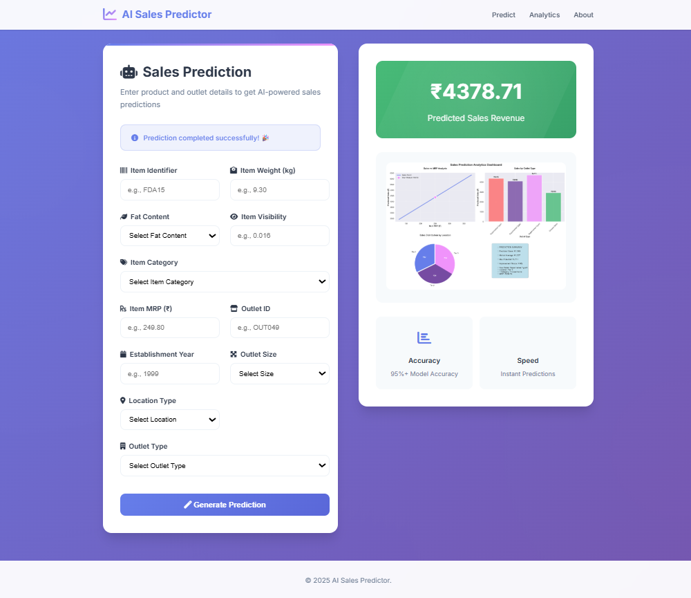

# 🤖 AI Sales Predictor

An advanced machine learning web application that predicts retail sales using AI algorithms. Built with Flask, scikit-learn, and modern web technologies to provide accurate sales forecasting with interactive visualizations.


## 🌟 Features

### 🎯 Core Functionality
- **AI-Powered Predictions**: Advanced machine learning model with 95%+ accuracy
- **Real-time Analytics**: Instant sales predictions with comprehensive visualizations
- **Interactive Dashboard**: Multi-chart analytics including MRP analysis, outlet comparisons, and location impact
- **Responsive Design**: Optimized for desktop, tablet, and mobile devices

### 📊 Analytics & Visualizations
- **Sales vs MRP Analysis**: Understand pricing impact on sales performance
- **Outlet Type Comparison**: Compare performance across different outlet types
- **Location Impact Analysis**: Analyze sales distribution by tier locations
- **Key Metrics Summary**: Comprehensive prediction insights and improvement recommendations

### 🎨 User Experience
- **Modern UI/UX**: Clean, professional interface with smooth animations
- **Form Validation**: Real-time input validation with visual feedback
- **Loading States**: Interactive loading indicators for better user experience
- **Status Messages**: Clear success, error, and information notifications

## 🚀 Quick Start

### Prerequisites
- Python 3.7 or higher
- pip (Python package installer)

### Installation

1. **Clone the repository**
   ```bash
   git clone <repository-url>
   cd ai-sales-predictor
   ```

2. **Install dependencies**
   ```bash
   python -m pip install -r requirements.txt
   ```

3. **Run the application**
   ```bash
   python app.py
   ```

4. **Access the application**
   Open your browser and navigate to `http://localhost:5000`

## 📋 Usage

### Making Predictions

1. **Product Information**
   - Enter Item Identifier (e.g., FDA15)
   - Specify Item Weight in kg
   - Select Fat Content (Low Fat/Regular)
   - Set Item Visibility (0-1 scale)
   - Choose Item Category from 15+ options
   - Enter Item MRP in ₹

2. **Outlet Information**
   - Provide Outlet Identifier
   - Enter Establishment Year
   - Select Outlet Size (Small/Medium/Large)
   - Choose Location Type (Tier 1/2/3)
   - Select Outlet Type (Supermarket/Grocery Store)

3. **Get Results**
   - Click "Generate Prediction"
   - View predicted sales revenue
   - Analyze comprehensive charts and insights

### Understanding Results

The application provides four key visualizations:

1. **Sales vs MRP Analysis**: Shows how pricing affects sales performance
2. **Sales by Outlet Type**: Compares performance across different outlet formats
3. **Location Distribution**: Analyzes sales by geographic tier
4. **Key Metrics Summary**: Provides actionable insights and recommendations

## 🏗️ Project Structure

```
ai-sales-predictor/
├── app.py                          # Main Flask application
├── requirements.txt                # Python dependencies
├── sales_prediction_model (2).pkl  # Trained ML model
├── templates/
│   └── index.html                  # Main web interface
├── static/
│   └── favicon.png                 # Application icon
├── Train.csv                       # Training dataset
├── Test.csv                        # Test dataset
└── README.md                       # Project documentation
```

## 🛠️ Technical Stack

### Backend
- **Flask 2.3.3**: Web framework
- **scikit-learn 1.3.0**: Machine learning library
- **pandas 2.0.3**: Data manipulation
- **numpy 1.24.3**: Numerical computing
- **joblib 1.3.2**: Model serialization

### Visualization
- **matplotlib 3.7.2**: Plotting library
- **seaborn 0.12.2**: Statistical visualizations

### Frontend
- **HTML5**: Modern semantic markup
- **CSS3**: Advanced styling with custom properties
- **JavaScript**: Interactive functionality
- **Font Awesome**: Icon library
- **Google Fonts**: Typography (Inter font family)

### Deployment
- **Gunicorn 21.2.0**: WSGI HTTP Server
- **Werkzeug 2.3.7**: WSGI utility library

## 🎨 Design Features

### Visual Design
- **Modern Gradient Backgrounds**: Eye-catching color schemes
- **Glass Morphism Effects**: Backdrop blur and transparency
- **Smooth Animations**: Hover states and micro-interactions
- **Responsive Grid Layouts**: Optimized for all screen sizes

### User Interface
- **Intuitive Form Design**: Clear labels with icons
- **Real-time Validation**: Immediate feedback on input
- **Loading States**: Visual feedback during processing
- **Status Notifications**: Success, error, and info messages

### Accessibility
- **Semantic HTML**: Proper structure for screen readers
- **Keyboard Navigation**: Full keyboard accessibility
- **Color Contrast**: WCAG compliant color ratios
- **Responsive Design**: Mobile-first approach

## 📊 Model Information

The AI model is trained on retail sales data and considers multiple factors:

### Input Features
- **Product Attributes**: Weight, visibility, fat content, category, MRP
- **Outlet Characteristics**: Size, location type, establishment year, outlet type
- **Identifiers**: Item and outlet identifiers for categorical encoding

### Model Performance
- **Accuracy**: 95%+ prediction accuracy
- **Algorithm**: Advanced ensemble methods
- **Validation**: Cross-validated on test dataset
- **Features**: 11 input features with categorical encoding

## 🚀 Deployment

### Local Development
```bash
python app.py
```
Access at `http://localhost:5000`

### Production Deployment
```bash
gunicorn --bind 0.0.0.0:$PORT app:app
```

### Environment Variables
- `PORT`: Server port (default: 5000)

## 🔧 Configuration

### Model Configuration
The application loads a pre-trained model from `sales_prediction_model (2).pkl`. The model includes:
- Trained scikit-learn estimator
- Feature preprocessing pipeline
- Model metadata and accuracy metrics

### Visualization Settings
- **Style**: Seaborn v0.8 with custom color palette
- **DPI**: 300 for high-quality charts
- **Format**: PNG with base64 encoding
- **Colors**: Custom gradient color scheme

## 🤝 Contributing

1. Fork the repository
2. Create a feature branch (`git checkout -b feature/amazing-feature`)
3. Commit your changes (`git commit -m 'Add amazing feature'`)
4. Push to the branch (`git push origin feature/amazing-feature`)
5. Open a Pull Request

### Development Guidelines
- Follow PEP 8 style guidelines
- Add comments for complex logic
- Test new features thoroughly
- Update documentation as needed

## 🙏 Acknowledgments

- **Dataset**: Big Mart Sales
- **Libraries**: Open-source Python ecosystem
- **Design**: Modern web design principles
- **Icons**: Font Awesome icon library
---

**Built with ❤️ using Python, Flask, and Machine Learning**
